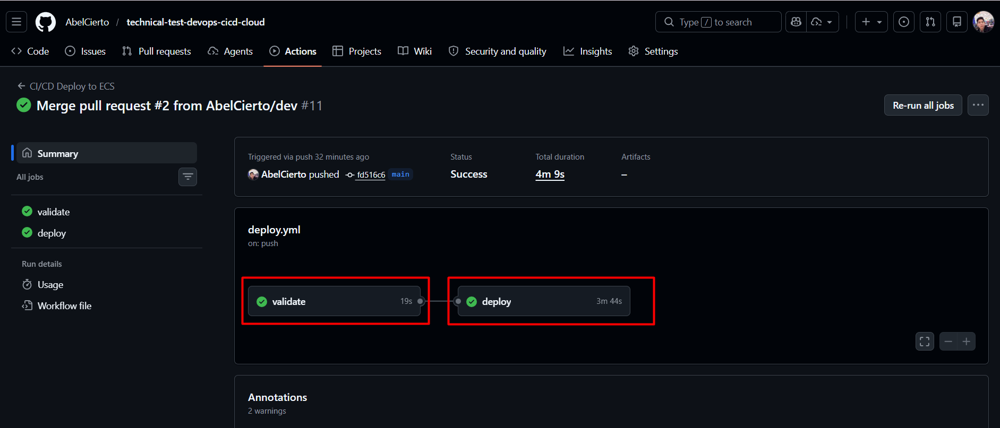
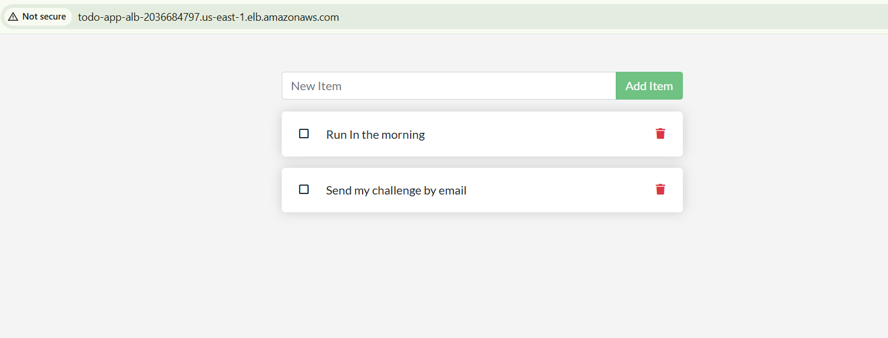
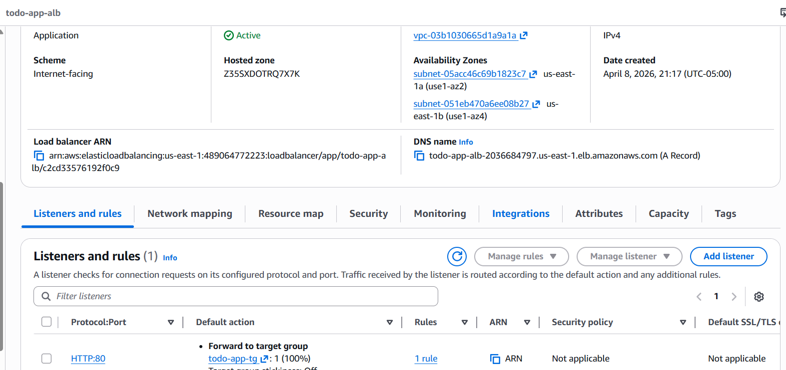
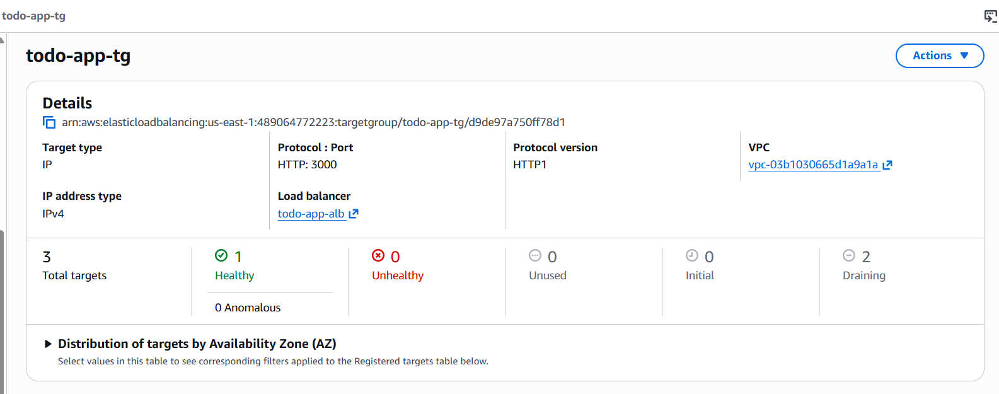
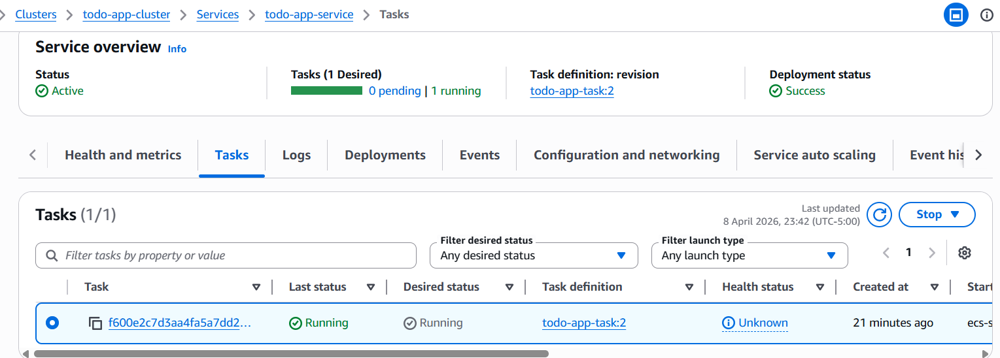
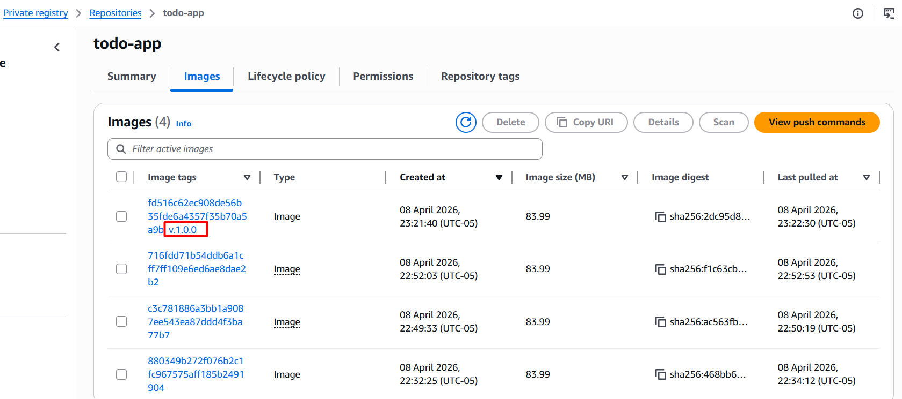
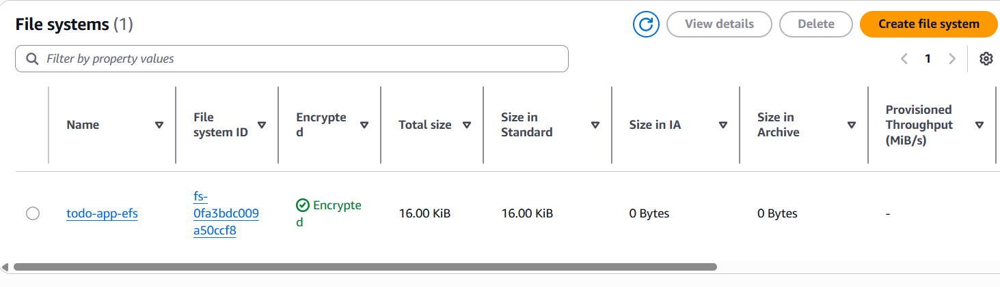
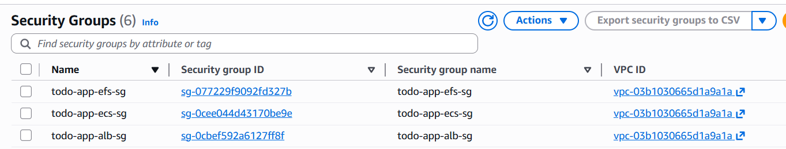

# Prueba Técnica DevOps – CI/CD + Cloud

---

## 1. Pipeline de CI/CD

### Repositorio base elegido

**Opción 3 – App Web** ([docker/getting-started](https://github.com/docker/getting-started/tree/master/app))

Aplicación Todo List escrita en Node.js + Express con frontend React que persiste datos en SQLite.

---

### ¿Qué herramienta CI/CD elegiste y por qué?

**GitHub Actions.**

- Está integrada nativamente con GitHub, sin necesidad de instalar ni mantener un servidor externo (como Jenkins).
- Ofrece runners gratuitos con Docker preinstalado.
- Soporta OIDC nativo para autenticarse con AWS sin guardar access keys como secretos, lo cual es más seguro.
- Para una prueba técnica donde se busca simplicidad y funcionalidad, es la opción más directa.

---

### ¿Por qué esa nube?

**AWS (Amazon Web Services).**

- ECS Fargate permite correr contenedores sin administrar servidores (serverless compute).
- ECR como registro privado de imágenes Docker está totalmente integrado.
- ALB (Application Load Balancer) distribuye tráfico y expone la app al público.
- EFS (Elastic File System) resuelve la persistencia para contenedores efímeros.
- IAM + OIDC permite autenticación segura desde GitHub Actions sin credenciales de larga duración.

---

### ¿Por qué usar Docker?

**Sí, se usa Docker.**

- Empaqueta la aplicación y todas sus dependencias en una imagen inmutable.
- Garantiza que lo que se prueba en CI es exactamente lo que se despliega.
- ECS requiere imágenes de contenedores para funcionar.
- Facilita reproducibilidad: cualquier desarrollador puede levantar la app localmente con `docker build` + `docker run`.

---

### Etapas del pipeline

El pipeline tiene **2 jobs** definidos en `.github/workflows/deploy.yml`:

#### Job 1: `validate` (CI)
Se ejecuta en **push** y **pull requests** a `main`.

| Paso | Descripción |
|------|-------------|
| Checkout | Descarga el código del repositorio |
| Setup Node | Instala Node.js 18 |
| Install dependencies | Ejecuta `yarn install` en la carpeta `./app` |
| Run tests | Ejecuta `yarn test` (Jest) para validar la lógica de negocio |
| Lint check | Verifica formato de código con Prettier |

#### Job 2: `deploy` (CD)
Se ejecuta **solo en push a `main`** (no en PRs) y depende de que `validate` pase.

| Paso | Descripción |
|------|-------------|
| Checkout | Descarga el código |
| Configure AWS credentials | Usa OIDC para asumir un IAM Role en AWS (sin access keys) |
| Login to Amazon ECR | Obtiene token de autenticación para el registro Docker privado |
| Build, tag and push image | Construye la imagen Docker, la tagea con `v.1.0.0` (versión semántica) y con el SHA del commit (trazabilidad), y sube ambos tags a ECR |
| Force new ECS deployment | Ejecuta `aws ecs update-service --force-new-deployment` para que ECS lance nuevas tareas con la imagen actualizada |
| Wait for service stability | Ejecuta `aws ecs wait services-stable` hasta que el servicio esté saludable con las nuevas tareas corriendo |

---

### ¿Qué dispara la ejecución del pipeline?

- **Push a `main`**: ejecuta validación + deploy completo.
- **Pull request a `main`**: ejecuta solo la validación (tests + lint), sin desplegar.

---

### ¿Dónde está desplegada la app?

En **AWS ECS Fargate** (región `us-east-1`), detrás de un **Application Load Balancer**.

---

### ¿Cómo se accede?

La aplicación está disponible en:

```
http://todo-app-alb-2036684797.us-east-1.elb.amazonaws.com/
```

---

## 2. Arquitectura de Solución

### 2.1 Diagrama y Análisis del Flujo de Tráfico

```
┌──────────┐     ┌─────────────────┐     ┌──────────────────┐     ┌──────────────────┐
│ Usuario  │────▶│  ALB (puerto 80) │────▶│  ECS Fargate     │────▶│  SQLite en EFS   │
│ Browser  │     │  Security Group:  │     │  Security Group:  │     │  /etc/todos/     │
│          │     │  0.0.0.0/0 → 80  │     │  ALB SG → 3000   │     │  todo.db         │
└──────────┘     └─────────────────┘     └──────────────────┘     └──────────────────┘
```

**Punto de Entrada:**
- El usuario accede vía HTTP al DNS público del ALB.
- El ALB escucha en el puerto 80 y reenvía al target group en el puerto 3000.

**Seguridad:**
- **ALB Security Group**: solo permite tráfico HTTP (puerto 80) desde Internet.
- **ECS Security Group**: solo acepta tráfico en puerto 3000 **proveniente del ALB** (referencia al SG del ALB).
- **EFS Security Group**: solo permite NFS (puerto 2049) desde el SG de ECS.
- **IAM**: GitHub Actions usa OIDC — no hay access keys ni secrets de larga duración.
- **ECR**: escaneo de vulnerabilidades activado en cada push de imagen.

**API Gateway:** No se utiliza. Para una app simple con frontend y API en el mismo contenedor, el ALB es suficiente. Un API Gateway se justificaría si existiera un backend de microservicios con autenticación, rate limiting o transformación de requests.

**Cómputo:**
- ECS Fargate — serverless, no hay instancias EC2 que administrar.
- 256 CPU units / 512 MB de memoria.
- Escalable horizontalmente mediante `desired_count`.

---

### 2.2 Estrategia de Persistencia

**Problema:** Los contenedores son efímeros. La app usa SQLite, que guarda datos en un archivo local (`/etc/todos/todo.db`). Si el contenedor se reinicia o escala, se pierden los datos.

**Solución implementada: Amazon EFS (Elastic File System)**

- Se crea un filesystem EFS cifrado.
- Se montan targets en las 2 subnets de las AZs.
- En la task definition de ECS, se define un volumen EFS montado en `/etc/todos`.
- Todos los contenedores (incluso si hay múltiples réplicas) leen/escriben el mismo filesystem.
- Los datos **sobreviven** reinicios, redeployments y escalado.

**Alternativas consideradas:**
| Opción | Pros | Contras |
|--------|------|---------|
| EFS (elegida) | Simple, compatible con SQLite, sin cambios en código | No escala escrituras concurrentes |
| RDS (PostgreSQL/MySQL) | Mejor para concurrencia, backups automáticos | Requiere cambiar código de la app |
| DynamoDB | Serverless, altamente escalable | Requiere reescribir la capa de persistencia |
| S3 | Barato, duradero | No apto para bases de datos |

---

## 3. Infraestructura como Código (IaC)

Se incluye un template de **Terraform** en la carpeta `terraform/` que automatiza la creación de todos los recursos.

### Recursos creados

| Recurso | Descripción |
|---------|-------------|
| VPC + 2 Subnets públicas | Red aislada con conectividad a Internet |
| Internet Gateway + Route Table | Permite tráfico saliente/entrante |
| Security Groups (ALB, ECS, EFS) | Control de tráfico entre capas |
| ECR Repository | Registro privado de imágenes Docker |
| EFS File System + Mount Targets | Almacenamiento persistente |
| ALB + Target Group + Listener | Balanceador de carga público |
| ECS Cluster + Task Def + Service | Orquestación de contenedores Fargate |
| IAM Roles (ECS execution, task, GitHub Actions) | Permisos con least privilege |
| OIDC Provider | Autenticación segura para GitHub Actions |
| CloudWatch Log Group | Logs centralizados del contenedor |

### Cómo usar

```bash
cd terraform
terraform init
terraform plan
terraform apply
```

> Las variables (región, repo de GitHub, credenciales AWS, etc.) se configuran en `terraform.tfvars`. Ver `terraform.tfvars.example` como referencia.

Tras el apply, los outputs mostrarán:
- `app_url` — URL pública de la aplicación
- `github_actions_role_arn` — ARN del IAM Role a configurar como secret `AWS_ROLE_ARN` en GitHub

### Secrets requeridos en GitHub

| Secret | Valor | Descripción |
|--------|-------|-------------|
| `AWS_ROLE_ARN` | output `github_actions_role_arn` | IAM Role que el pipeline asume vía OIDC |

> Configurar en: Repo → Settings → Secrets and variables → Actions → New repository secret

---

## Uso de IA

Sí, se utilizó IA (GitHub Copilot) como herramienta de apoyo. Estimación de intervención por área:

| Área | % IA | Detalle |
|------|------|---------|
| Diseño de arquitectura | 0% | Elección de servicios AWS, flujo de tráfico y estrategia de persistencia |
| Pipeline CI/CD | 10% | Consulta de sintaxis de GitHub Actions y acciones de AWS |
| Terraform (IaC) | 15% | Validación de sintaxis HCL y consulta de parámetros de recursos AWS |
| Dockerfile | 0% | Configuración basada en documentación oficial de Node.js |
| README / Documentación | 20% | Apoyo en redacción y organización de secciones |
| Troubleshooting | 10% | Diagnóstico de errores puntuales (permisos en tests, credenciales) |

**Estimación global: ~10% de intervención de IA.**

---

## Evidencias

### Pipeline CI/CD – GitHub Actions
Ejecución exitosa del pipeline con los jobs `validate` y `deploy` completados:



### Aplicación desplegada
La aplicación Todo List funcionando en el navegador a través del ALB:



### Application Load Balancer (ALB)
ALB activo, internet-facing, con listener HTTP:80 redirigiendo al target group:



### Target Group
Target group `todo-app-tg` con target healthy en puerto 3000:



### ECS Fargate Service
Servicio `todo-app-service` activo con 1 task running (Fargate):



### ECR – Registro de imágenes Docker
Repositorio `todo-app` con imágenes tagueadas por commit SHA y versión semántica:



### EFS – Almacenamiento persistente
Filesystem `todo-app-efs` cifrado, montado en los contenedores para persistir SQLite:



### Security Groups
Tres security groups creados (ALB, ECS, EFS) con reglas de tráfico segmentadas:

